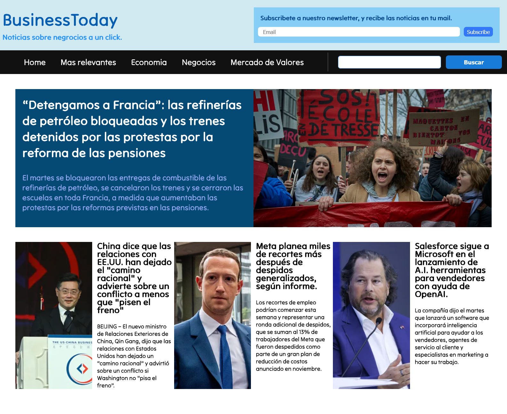

# Project Title

Diseño web responsive.

## Description

Esta es una pagina web para demostrar el uso de responsive design y el uso de FlexBox asi como de Flex Grid.

## Table of contents

- [Overview](#overview)
  - [Screenshot](#screenshot)
  - [Links](#links)
- [My process](#my-process)
  - [Built with](#built-with)
- [Author](#author)

**Note: Delete this note and update the table of contents based on what sections you keep.**

## Overview

### Screenshot

### Links

- Live Site URL: (https://yefreescoding.github.io/News-web-page/)

## My process

### Built with

- Semantic HTML5 markup
- CSS
- Flexbox
- CSS Grid
- Mobile First Design

### What I learned
I learned the fundamentals for the responsive design, FlexBox and CSS Grid.

## Author

- Website - (https://github.com/yefreescoding)
- Frontend Mentor - (https://www.frontendmentor.io/profile/yefreescoding)
- Twitter - (https://twitter.com/YefreeCodes)
